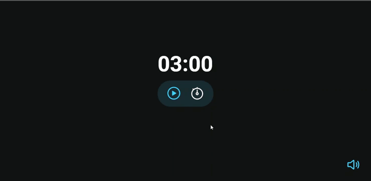

# <h1 align="center">Timer Focus</h1>

A simple stopwatch for studies. Project developed in the RocketSeat Explorer course.

  <a href="#-Features">Features</a>&nbsp;&nbsp;&nbsp;|&nbsp;&nbsp;&nbsp;
  <a href="#-Technologies">Technologies</a>&nbsp;&nbsp;&nbsp;|&nbsp;&nbsp;&nbsp;
  <a href="#-Project">Project</a>&nbsp;&nbsp;&nbsp;|&nbsp;&nbsp;&nbsp;
  <a href="#memo-License">License</a>

  

## ✔ Features

- Play/pause button
- Stop button
- Set time option
- Sound button

## 🚀 Technologies

- HTML e CSS
- JavaScript
- Git e Github
- Figma

## 💻 Project

  

## 📝 License

  

 
